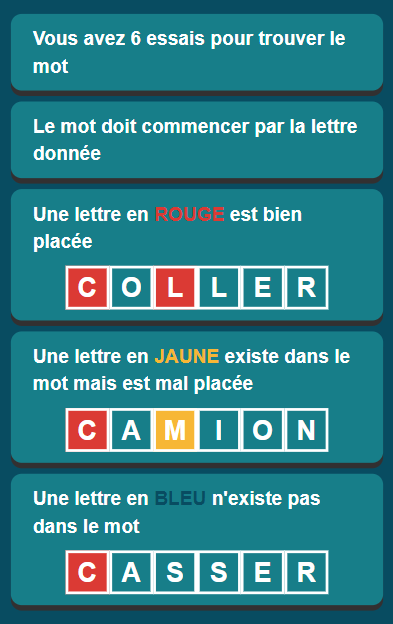

# SUTOMAX

## SUTOM / TUSMO / MOTUS

[Motus](https://fr.wikipedia.org/wiki/Motus_(jeu_t%C3%A9l%C3%A9vis%C3%A9)), aussi connu sous le nom de Wordle (version anglaise), est un jeu simple basé sur la recherche de mots d'un nombre fixé de lettres. Il existe différentes variantes du jeu en ligne, telles que [SUTOM](https://sutom.nocle.fr/) ou [TUSMO](https://www.tusmo.xyz/). 

[Le projet SUTOM est disponible en open-source ici](https://framagit.org/JonathanMM/sutom).

### Règles du jeu

Reprenons les règles décrites par TUSMO :

A cela s'ajoute des méta-règles concernant la génération du mot mystère :

* Le mot mystère doit contenir entre 6 et 10 lettres (inclus) (ou, anticonstitutionnellement...) 
* Le mot mystère n'est pas un nom propre (France, Caroline... )
* La première lettre du mot ne peut pas être exotique (K, Q, W, X, Y, Z)
* Le mot mystère ne contient pas d'espace, de trait d'union ou d'apostrophe (a priori, arc-en-ciel, aujourd'hui...)

## SUTOMAX 

### Introduction

sutomax présente (pour le moment) une interface CLI pour vous aider à terminer une partie de SUTOM. 

### TODO

* Intégration d'une interface graphique (Textual)
* Mode solo (jouer seul)
* Recherche de mots optimisée
* Refactorisation